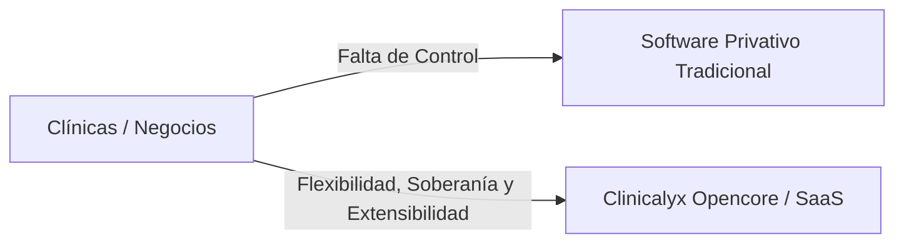
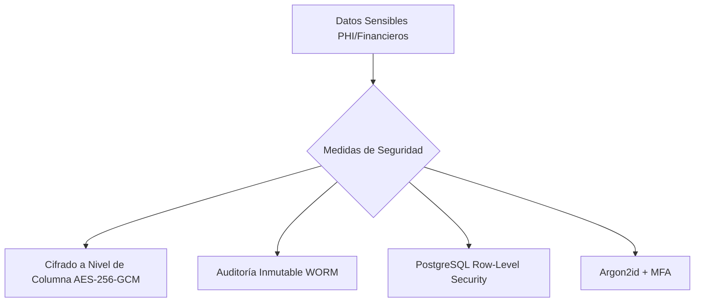
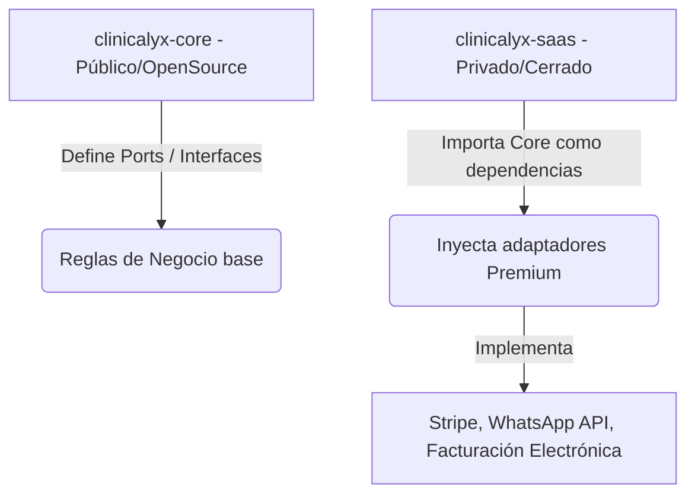

# Plan de Implementación: Clinicalyx Opencore & SaaS Enterprise

Este documento establece la visión estratégica, el modelo de negocio, la arquitectura técnica, la seguridad de datos, el mapa de características, el flujo de Git profesional y la metodología TDD para el proyecto **Clinicalyx**.

---

## 1. Visión Estratégica y Negocio

### ¿Qué es Clinicalyx?
**Clinicalyx** es una plataforma modular de gestión clínica enterprise y de código abierto (**Opencore**). Nace para revolucionar la forma en que los centros de salud gestionan su agenda, pacientes, expedientes clínicos y finanzas, eliminando la rigidez y los altos costos del software privativo tradicional.



### Propuesta de Valor (¿Por qué ayuda a las empresas?)
* **Soberanía y Seguridad de Datos:** A diferencia de las soluciones cerradas en la nube, las grandes clínicas y hospitales exigen control total sobre sus datos de pacientes debido a leyes de privacidad y normativas de salud (HIPAA, GDPR). Clinicalyx les permite hostear su propia infraestructura (on-premise o en su nube privada).
* **Modularidad a Medida:** La mayoría de los softwares del mercado son genéricos o hiper-específicos. Clinicalyx provee un núcleo unificado para la administración, y permite "conectar" módulos específicos por especialidad (ej. un odontograma interactivo para odontólogos, o fichas fotográficas de evolución para medicina estética).
* **Eficiencia Operativa:** El control financiero transaccional estricto (Double-Entry Ledger) evita pérdidas de dinero por abonos mal registrados o desorganización en el flujo de caja diario.

### Modelo de Negocio (Opencore & SaaS)
El proyecto se monetiza bajo un esquema de **Núcleo Abierto (Opencore)**:
1. **Community Edition (Open Source):** Gratuita y autogestionada. Permite a consultorios individuales digitalizar su negocio básico de forma soberana. Crea tracción en la comunidad de desarrolladores y médicos, posicionando a Clinicalyx como el estándar de facto.
2. **SaaS Cloud (Pago por Suscripción):** Clinicalyx administrado en la nube con cobro mensual por usuario o por clínica. Incluye backups automatizados, infraestructura escalable y actualizaciones sin fricción.
3. **Enterprise Edition (Módulos Cerrados):** Clínicas grandes y SaaS consumen módulos premium licenciados (facturación electrónica legal, recordatorios automáticos por WhatsApp API, dashboards de analítica de negocio).

### ¿Cómo estamos innovando?
* **Arquitectura de Ficha Clínica Inyectable (JSONB Mitigado):** Diseñamos un sistema híbrido. En lugar de reescribir tablas SQL para cada especialidad, las consultas analíticas e indexables (ej. diagnósticos CIE-10, alergias, signos vitales) se almacenan en tablas relacionales estrictas. Usamos columnas JSONB dinámicas únicamente en la capa de presentación para los detalles clínicos específicos de cada especialidad (ej. el estado visual de las piezas de un odontograma), garantizando rendimiento analítico y flexibilidad extrema sin comprometer el tipado fuerte en Go.
* **Ingeniería Enterprise desde el Día 1:** Usamos **Arquitectura Hexagonal en Go** y **TDD pragmático**. Esto no es el típico proyecto web "juguete" con Laravel acoplado o código espagueti. Es una infraestructura robusta de nivel bancario, diseñada para durar y escalar.

### Proyecciones a Futuro
* **Inteligencia Artificial Clínica (Fase 2):** Copiloto de dictado por voz que transcribe y resume las notas del médico directamente a la historia clínica en formato estructurado (S.O.A.P.).
* **Integración con IoT de Salud:** Recepción de datos de dispositivos médicos portátiles para el seguimiento remoto de pacientes.
* **Ecosistema de Módulos (Marketplace):** Permitir a desarrolladores externos crear y vender adaptadores de especialidades médicas sobre el Core de Clinicalyx.

---

## 2. Arquitectura de Seguridad (HIPAA, GDPR y Blindaje Bancario)

La seguridad de datos de salud y financieros no es una característica que se añade al final; se diseña desde los cimientos (**Security by Design**). En Clinicalyx aplicaremos los siguientes estándares de seguridad enterprise:



### A. Cifrado de Datos en Reposo y en Tránsito
* **En Tránsito:** TLS 1.3 forzado con HSTS (HTTP Strict Transport Security) obligatorio. Ninguna petición viajará sin cifrar.
* **Cifrado Híbrido a Nivel de Aplicación:**
  * **Datos Sensibles sin Búsqueda (PHI Descriptivo):** Los campos de texto libre clínicos, evoluciones y recetas se cifrarán en Go usando **AES-256-GCM** (no determinista) antes de guardarse en la BD.
  * **Búsquedas Exactas (DNI/CI, Email, Teléfono):** Se cifran con AES-256-GCM para visualización. Adicionalmente, se genera un **Blind Index (Índice Ciego)** calculado en Go como `HMAC-SHA256(normalizar(dato), secret_salt)` con un índice B-Tree en la base de datos para búsquedas rápidas exactas en $O(1)$. La normalización previa limpia espacios, convierte a minúsculas y elimina caracteres especiales.
  * **Búsquedas Parciales (Nombres):** Se guardan en texto plano indexable en la base de datos para permitir búsquedas eficientes con `ILIKE`, pero protegidos por **Row-Level Security (RLS)** y cifrado de volumen a nivel de infraestructura (**Transparent Data Encryption - TDE**).
  * **Entornos de Desarrollo y Backups (Data Masking):** Se implementará un script obligatorio de enmascaramiento de datos que anonimiza o reemplaza nombres reales por datos ficticios (ej. usando la librería Faker de Go) antes de que un dump de producción viaje a entornos de desarrollo o staging.
* **Gestión de Claves Externa:** La clave maestra de descifrado (KEK) no se almacenará en la base de datos, sino que se gestionará mediante un servicio externo de KMS (AWS KMS, HashiCorp Vault o Azure Key Vault) con rotación automática de claves.

### B. Bitácora de Auditoría de Dos Niveles (Hot / Cold Tier)
* HIPAA exige que cada acceso (lectura o escritura) a datos de salud de un paciente quede registrado de manera auditable. Implementaremos un flujo híbrido:
  * **Hot Tier (Consulta Operativa):** Los logs se escriben en una tabla particionada de PostgreSQL para permitir consultas y dashboards instantáneos para los administradores clínicos en el frontend.
  * **Cold Tier (Cumplimiento Legal):** Un worker asíncrono en Go empaquetará los logs calientes diariamente y los subirá a un bucket S3 con bloqueo de objetos (**Object Lock WORM**) inalterable durante el periodo de retención obligatorio de la ley.

### C. Aislamiento Multi-Tenant con PostgreSQL RLS
* Para blindar el SaaS y evitar filtraciones de datos entre clínicas (ataques tipo IDOR), utilizaremos **Row-Level Security (RLS)** en PostgreSQL.
* **Flujo Transaccional Seguro (Wrapper SET LOCAL):**
  * Para evitar fugas de estado (*State Leak*) en el pool de conexiones de Go, el `tenant_id` se inyecta en la sesión mediante `SET LOCAL app.current_tenant = 'val'` dentro de una transacción.
  * Para mantener el código **DRY** y evitar repetir el boilerplate de transacciones en cada consulta, implementaremos un ejecutador seguro (`ExecuteInTenantTx`):
    ```go
    func ExecuteInTenantTx(ctx context.Context, db *sql.DB, fn func(tx *sql.Tx) error) error {
        tenantID, ok := contextutils.TenantFromContext(ctx)
        if !ok { return ErrMissingTenant }
        tx, err := db.BeginTx(ctx, nil)
        if err != nil { return err }
        defer tx.Rollback()
        if _, err := tx.ExecContext(ctx, "SET LOCAL app.current_tenant = $1", tenantID); err != nil {
            return err
        }
        if err := fn(tx); err != nil { return err }
        return tx.Commit()
    }
    ```
  * Los repositorios de la capa de adaptadores usarán obligatoriamente este wrapper para encapsular el SQL, garantizando que el aislamiento sea automático y a prueba de olvidos.
* Cada consulta a la base de datos se validará a nivel de motor de PostgreSQL inyectando el `tenant_id` de la sesión. Incluso si el desarrollador comete un error en el código de Go y olvida un filtro `WHERE`, el motor de base de datos denegará el acceso si el registro no pertenece a la clínica del usuario autenticado.

### D. Gestión de Identidades Bancaria
* **Hashing de Contraseñas:** Usaremos **Argon2id** (recomendado por OWASP y el estándar de oro actual) en lugar de herramientas obsoletas como MD5 o Bcrypt.
* **Autenticación Multifactor (MFA):** Requisito obligatorio para administradores y personal médico a través de TOTP (Google Authenticator, Authy).
* **Sesiones Seguras y JWT de Vida Corta (Mitigación Stateless):** 
  * Los Access Tokens tendrán una vida útil muy corta (máximo 15 minutos).
  * Los Refresh Tokens se almacenarán de forma segura en la base de datos o en Redis para permitir la renovación de sesiones sin requerir las credenciales del usuario de forma constante.
  * Implementaremos un **Middleware de Denylist** en la capa del router Chi que verificará activamente el estado de revocación del Token o la sesión en una memoria rápida (Redis o tabla pequeña de BD) para bloquear accesos de forma instantánea ante la desactivación o despido de personal, resolviendo la vulnerabilidad nativa de los JWT.
  * Los tokens JWT de sesión se almacenarán estrictamente en cookies HTTP-only, Secure y SameSite=Strict para mitigar ataques XSS y CSRF.

### E. Anonimización y Derecho al Olvido (GDPR)
* Cumpliendo con el **GDPR**, el sistema soportará la seudonimización de datos. Si un paciente solicita el "Derecho al Olvido", el sistema borrará sus datos identificatorios (nombres, teléfono, documento) pero conservará de forma anonimizada las historias clínicas para análisis estadístico e histórico de tratamientos de la clínica, sin posibilidad de re-identificación.

---

## 3. Estrategia de Repositorio: ¿Uno o Dos Proyectos?

Para comercializar un producto **Opencore** y a la vez ofrecer una versión **SaaS de pago**, la mejor decisión arquitectónica es usar **repositorios separados con inyección de dependencias**. 



### Ejemplo Conceptual en Go (Cómo se inyecta la lógica Premium)

#### A. En el repositorio público (`clinicalyx-core`)
Definimos los contratos (Puertos) de salida para los servicios que pueden tener versiones comunitarias básicas o versiones premium complejas.

```go
// File: clinicalyx-core/internal/ports/outbound/payment.go
package outbound

// PaymentGateway define el puerto de salida para procesar cobros
type PaymentGateway interface {
    ProcessPayment(amount float64, currency string) (transactionID string, err error)
}
```

El Core consume este puerto en su lógica de negocio (Casos de Uso) sin saber cómo está implementado físicamente:

```go
// File: clinicalyx-core/internal/usecases/payment_usecase.go
package usecases

import "clinicalyx/internal/ports/outbound"

type ProcessPaymentUseCase struct {
    gateway outbound.PaymentGateway // Dependencia abstracta (Port)
}

func NewProcessPaymentUseCase(g outbound.PaymentGateway) *ProcessPaymentUseCase {
    return &ProcessPaymentUseCase{gateway: g}
}

func (uc *ProcessPaymentUseCase) Execute(amount float64) (string, error) {
    // Lógica del Core: validaciones de saldo, registrar en libro diario, etc.
    return uc.gateway.ProcessPayment(amount, "USD")
}
```

#### B. En el repositorio privado (`clinicalyx-saas` o extensiones premium)
Implementamos el adaptador real utilizando un servicio de pago premium como Stripe:

```go
// File: clinicalyx-premium/adapters/stripe_adapter.go
package adapters

import "github.com/stripe/stripe-go/v72"

type StripeAdapter struct {
    apiKey string
}

func NewStripeAdapter(key string) *StripeAdapter {
    return &StripeAdapter{apiKey: key}
}

// Implementación del método de la interfaz definida en el Core público
func (s *StripeAdapter) ProcessPayment(amount float64, currency string) (string, error) {
    // Lógica privada premium para llamar a las APIs de Stripe
    return "stripe_txn_ok_12345", nil
}
```

#### C. En el arranque de la aplicación SaaS
En el punto de entrada de la aplicación SaaS, importamos el Core público e inyectamos el adaptador privado:

```go
// File: clinicalyx-saas/cmd/api/main.go
package main

import (
    "github.com/carlos/clinicalyx-core/internal/usecases"
    "github.com/carlos/clinicalyx-saas/adapters"
)

func main() {
    // 1. Inicializar adaptador premium (privado)
    stripeGateway := adapters.NewStripeAdapter("sk_live_xxxx")
    
    // 2. Inyectar adaptador privado en el caso de uso del Core público
    processPaymentUC := usecases.NewProcessPaymentUseCase(stripeGateway)
    
    // 3. Arrancar servidor web y endpoints...
}

#### D. Estrategia de Migraciones y Esquemas Separados
Para mantener la separación limpia entre el Core Open Source y el SaaS propietario:
* **Esquemas Separados:** Usaremos esquemas lógicos separados en PostgreSQL: `core_data` (para tablas comunitarias) y `saas_data` (para tablas premium como suscripciones). Esto permite foreign keys transversales evitando cruzar contextos lógicos.
* **Control de Migraciones:** El Core encapsulará sus propias migraciones SQL. El repositorio SaaS importará y ejecutará estas migraciones del Core antes de correr las suyas propias sobre el esquema `saas_data`.
```

---

## 4. Mapa de Características (Features)

Para un producto enterprise, las características se dividen entre lo que es de código abierto (Community) y lo que se comercializa bajo suscripción (Enterprise/SaaS):

| Módulo / Feature | Core (Community Edition - Open Source) | Enterprise / SaaS (Premium Edition - Closed Source) |
| :--- | :--- | :--- |
| **Multi-Tenancy** | Aislamiento básico a nivel lógico de datos (PostgreSQL RLS). | Base de datos dedicada por tenant (aislamiento físico para clínicas grandes) + Portal de facturación del plan SaaS. |
| **Pacientes** | CRUD clásico, ficha de datos personales, historial de visitas y perfil. | Búsqueda por IA semántica de pacientes, campos dinámicos customizables según clínica. |
| **Agenda & Citas** | Calendario mensual/semanal, reserva de citas y estados básicos. | Recordatorios automáticos por WhatsApp/SMS, telemedicina integrada y sincronización con Google Calendar. |
| **Historias Clínicas** | Expediente clínico básico con editor de texto enriquecido (HTML/Markdown). | **Especialidades Médicas Inyectables:** Odontograma interactivo, dermatología con galería de evolución comparativa de fotos, ginecología. |
| **Finanzas** | Registro de cobros, abonos y saldos (tipo de dato decimal estricto). | Facturación electrónica legal, control de flujo de caja, pasarelas de pago integradas (Stripe/PayPal), cálculo de comisiones a médicos. |
| **Seguridad & Auditoría** | Autenticación clásica con JWT (vida corta) + Refresh tokens en base de datos. Encriptación Bcrypt/Argon2id. | Autenticación Single Sign-On (SSO), Middleware de Denylist para revocación inmediata y Logs de auditoría inmutables (Hot/Cold Tier). |
| **Analítica Longitudinal** | Historial básico de visitas y listado de signos vitales. | Motor de Tendencias Gráficas (curvas de presión, glucosa) y cálculo de deltas en backend (+X% respecto a la visita anterior). Alertas visuales de biomarcadores fuera de rango clínico. |
| **Portal B2B (Corporativo)** | N/A (Exclusivo SaaS) | Portal independiente para empresas cliente (empresa.clinicalyx.com). Roster de empleados (carga masiva), agendamiento ocupacional masivo y mapa de calor epidemiológico anonimizado. Descarga segura de descansos médicos con RLS. |
| **LIMS (Laboratorio Nativo)** | Módulo de Laboratorio propio: flujo de órdenes y resultados (PENDING -> IN_PROGRESS -> COMPLETED). Notificación asíncrona interna (`LabResultCompleted`). Validación en dos pasos Maker-Checker (Borrador -> Aprobación de Jefe de Laboratorio). Restricción de acceso para laboratorista (no ve historia clínica). | Extracción automática por OCR de PDF de laboratorios con validación obligatoria del médico (Human-in-the-loop) guardado como Borrador preliminar, firmado digital con hash/QR e integración HL7/FHIR (Fase 2). |
| **Facturación B2B** | N/A (Exclusivo SaaS) | Cuentas corrientes por empresa cliente. Centro de costos consolidado para facturar atenciones acumuladas mensualmente con emisión de factura electrónica automatizada. |

---

## 5. Proposed Changes

La estructura del nuevo directorio oficial [clinicalyx](file:///home/carlos/Proyectos/clinicalyx) contendrá la versión **Core (Community)** como base del desarrollo local.

### [clinicalyx] (Core Open Source Repository)

#### [NEW] [backend/](file:///home/carlos/Proyectos/clinicalyx/backend)
Backend desarrollado en Go aplicando Arquitectura Hexagonal.
- `backend/cmd/api/`: Orquestador de inicio e inyección de dependencias.
- `backend/internal/domain/`: Modelos del negocio puros (ej. `Patient`, `Appointment`, `Payment`).
- `backend/internal/ports/`: Interfaces de comunicación (inbound y outbound).
- `backend/internal/usecases/`: Casos de uso de la aplicación (lógica de paciente, citas).
- `backend/internal/adapters/`: Controladores HTTP, repositorios de PostgreSQL y encriptación.

#### [NEW] [frontend/](file:///home/carlos/Proyectos/clinicalyx/frontend)
Frontend desarrollado en Next.js (React/TypeScript).

---

# Plan de Implementación: Infraestructura del Módulo de Citas (Agenda)

Este plan detalla el diseño y la implementación de los adaptadores de base de datos PostgreSQL (con exclusión GiST y RLS) y los controladores HTTP Chi para el Módulo de Citas de Clinicalyx.

## User Review Required

> [!IMPORTANT]
> **Extensión btree_gist y Restricción de Exclusión**: Para validar solapamientos temporales concurrentes de médicos, se utilizará una restricción de exclusión mediante `btree_gist` en PostgreSQL. Esto evita *race conditions* a nivel de motor de base de datos.
> **Aislamiento RLS**: Todas las operaciones se ejecutarán a través del helper `ExecuteInTenantTx` asegurando que el `tenant_id` de la sesión limite las operaciones.

## Proposed Changes

### [PostgreSQL Migrations]
#### [NEW] [000005_create_appointments_table.up.sql](file:///home/carlos/Proyectos/clinicalyx/backend/migrations/000005_create_appointments_table.up.sql)
Crea la tabla `appointments` utilizando rangos de tiempo nativos (`tsrange`) para evitar colisiones:
- Extensión: `CREATE EXTENSION IF NOT EXISTS btree_gist;`
- Restricción de exclusión: `prevent_doctor_double_booking EXCLUDE USING gist (tenant_id WITH =, doctor_id WITH =, time_range WITH &&);`
- Políticas de Row-Level Security (RLS) habilitadas y forzadas (`app.current_tenant`).
- Privilegios otorgados a `clinicalyx_app_user`.

### [Outbound Adapters]
#### [NEW] [appointment_repository.go](file:///home/carlos/Proyectos/clinicalyx/backend/internal/adapters/outbound/postgres/appointment_repository.go)
Implementa la persistencia de citas médicas:
- `Save`: Inserta los registros y convierte la fecha a `tsrange` usando `tsrange($5, $6, '[)')`. Si Postgres devuelve un error de violación de exclusión (`SQLSTATE 23P01`), retorna `domain.ErrDoctorNotAvailable`.
- `HasOverlap`: Consulta rápida `SELECT EXISTS` mediante el operador de solapamiento `&&` sobre el rango `tsrange`.
- `UpdateStatus`: Modifica el estado de una cita existente a `COMPLETED` o `CANCELED` bajo contexto de Tenant.

#### [MODIFY] [patient_repository_test.go](file:///home/carlos/Proyectos/clinicalyx/backend/internal/adapters/outbound/postgres/patient_repository_test.go)
Modifica `TestMain` para:
- Leer y ejecutar el script de migración SQL `000005_create_appointments_table.up.sql` durante la inicialización.
- Limpiar (DROP/TRUNCATE) la tabla `appointments` en los flujos de pruebas.

#### [NEW] [appointment_repository_test.go](file:///home/carlos/Proyectos/clinicalyx/backend/internal/adapters/outbound/postgres/appointment_repository_test.go)
Pruebas de integración de base de datos:
- Guardar citas de forma exitosa.
- Validar bloqueo automático ante colisiones simultáneas por la restricción de exclusión.
- Validar cumplimiento estricto de políticas RLS de inquilino (Tenant).

### [Inbound Adapters]
#### [NEW] [appointment_handler.go](file:///home/carlos/Proyectos/clinicalyx/backend/internal/adapters/inbound/http/appointment_handler.go)
Controlador HTTP Chi para citas médicas:
- `POST /api/v1/patients/{patient_id}/appointments` (Agendar cita). Extrae `tenant_id` y `doctor_id` del contexto.
- `PATCH /api/v1/appointments/{appointment_id}/cancel` (Cancelar cita).
- Mapeo de errores de dominio a respuestas semánticas JSON.

#### [NEW] [appointment_handler_test.go](file:///home/carlos/Proyectos/clinicalyx/backend/internal/adapters/inbound/http/appointment_handler_test.go)
Pruebas del controlador HTTP Chi para agendar y cancelar citas con mocks de los casos de uso.

### [Bootstrap]
#### [MODIFY] [main.go](file:///home/carlos/Proyectos/clinicalyx/backend/cmd/api/main.go)
Registra las dependencias:
- Instancia `PostgresAppointmentRepository`.
- Instancia `ScheduleAppointmentUseCase` y `CancelAppointmentUseCase` inyectando el nuevo repositorio de citas.
- Instancia y registra el `AppointmentHandler` con sus endpoints protegidos.

## Verification Plan

### Automated Tests
- Ejecutar la suite completa de pruebas unitarias y de integración:
  ```bash
  go test -v ./internal/adapters/...
  ```
- Validar RLS y restricciones de exclusión directamente contra el Postgres de pruebas.

---

# Plan de Implementación: Búsqueda de Pacientes e Historia Clínica (Perfil del Paciente)

Este plan detalla el diseño e implementación para completar el backend de búsqueda de pacientes mediante Blind Index (HMAC-SHA256) en Go, e implementar la interfaz de usuario para el Perfil Médico del Paciente en Next.js (shadcn/ui).

## User Review Required

> [!IMPORTANT]
> **Búsqueda mediante Blind Index**: El endpoint `GET /api/v1/patients` aceptará el query param `?document_id=...` y calculará el Blind Index del documento en memoria (Go) para hacer una búsqueda exacta indexada contra la base de datos de manera determinista, protegiendo los datos cifrados (AES-256-GCM).
> **Server Component en Next.js**: La vista del perfil médico se implementará en `/app/dashboard/patients/[id]/page.tsx` como un Server Component, haciendo uso de componentes UI estructurados (Tabs, Textarea, Switch).

## Proposed Changes

### [Backend Go - Core & Use Cases]
#### [NEW] [get_patient.go](file:///home/carlos/Proyectos/clinicalyx/backend/internal/core/usecases/get_patient.go)
Implementa el caso de uso `GetPatientUseCase` para recuperar pacientes por ID o por documento (intentando DNI y Pasaporte de forma transparente):
- `GetByID(ctx, tenantID, patientID)`: Recupera un paciente usando `FindByID`.
- `GetByDocument(ctx, tenantID, docValue)`: Intenta buscar usando `FindByDocument` con tipo `DNI` y `PASSPORT` como respaldo.

### [Backend Go - Inbound HTTP Adapters]
#### [MODIFY] [patient_handler.go](file:///home/carlos/Proyectos/clinicalyx/backend/internal/adapters/inbound/http/patient_handler.go)
Expone los endpoints GET:
- `GET /api/v1/patients`: Acepta el query parameter `?document_id=...` para buscar y listar pacientes usando el Blind Index. Retorna un array con el paciente o un array vacío si no se encuentra.
- `GET /api/v1/patients/{patient_id}`: Recupera un paciente específico por su ID.

#### [MODIFY] [main.go](file:///home/carlos/Proyectos/clinicalyx/backend/cmd/api/main.go)
Instancia `GetPatientUseCase` e inyecta la dependencia en `PatientHandler`.

### [Frontend Next.js]
#### [NEW] Componentes shadcn/ui
Instalación de las dependencias nativas de shadcn/ui en `frontend/`:
- `npx shadcn@latest add tabs textarea switch`

#### [NEW] [app/dashboard/patients/[id]/page.tsx](file:///home/carlos/Proyectos/clinicalyx/frontend/app/dashboard/patients/[id]/page.tsx)
Página Server Component del perfil del paciente:
- **Cabecera**: Nombre, Edad (calculada de `date_of_birth` o simulada), Badge/icono de "Secure / E2E Encrypted".
- **Tabs (shadcn)**:
  - "Consultation History": Renderiza una línea de tiempo (timeline) estilizada con consultas anteriores (fecha, diagnóstico CIE-10, notas clínicas).
  - "New Consultation": Formulario interactivo con un `Textarea` de notas clínicas, toggles de metadatos dinámicos ("Lab Tests Ordered", "Follow-up Required"), y un botón prominente para guardar.

## Verification Plan

### Automated Tests
- Ejecutar pruebas del backend para verificar la búsqueda por Blind Index:
  ```bash
  go test -v ./internal/adapters/inbound/http/...
  ```
- Validar visualmente la correcta renderización del Perfil del Paciente en el navegador.

---

# Plan de Implementación: Módulo 6 - Ephemeral Demo Mode, Rate Limiting y Recolector de Basura (Grim Reaper)

Este plan detalla el diseño e implementación del **Módulo 6: Ephemeral Demo Mode** en el backend de Go, asegurando políticas de Rate Limiting por IP para evitar abusos o ataques DDoS/Brute-force en un VPS público, configurando un recolector de basura automatizado para tenants demo expirados mediante cascada SQL, y protegiendo el enrutamiento con un Kill Switch configurable desde variables de entorno.

## User Review Required

> [!IMPORTANT]
> **Creación de la tabla `tenants`**: Dado que actualmente el `tenant_id` se maneja de forma implícita como UUID sin clave foránea, crearemos la tabla `tenants` y agregaremos claves foráneas con `ON DELETE CASCADE` en las tablas `users`, `patients`, `appointments`, `sessions` y `consultations`. Para evitar que la migración falle en bases de datos locales ya pobladas, primero insertaremos los `tenant_id` únicos preexistentes en la nueva tabla `tenants` antes de declarar los constraints.
>
> **Goroutine Recolectora (Grim Reaper)**: En el arranque del servidor (`main.go`), iniciaremos un ticker en segundo plano que ejecute una consulta de eliminación física (`DELETE FROM tenants WHERE is_demo = true AND expires_at < NOW()`) cada 15 minutos, la cual eliminará en cascada atómica toda la información efímera del sandbox sin dejar rastro de datos residuales.
>
> **Kill Switch**: El enrutador HTTP de Go leerá la variable de entorno `ENABLE_EPHEMERAL_DEMO` (por defecto `false`). Si es `false`, la ruta de creación de demo `/api/v1/demo/start` no se registrará y responderá con `404 Not Found` en lugar de exponer la lógica desactivada.

## Open Questions

> [!NOTE]
> 1. **Método de retorno del login de Demo**: ¿El endpoint de demo debe inyectar directamente la cookie HTTP-only `access_token` en el cliente (similar al flujo de login normal), o solo devolver el token JWT en el JSON de respuesta?
>    * *Propuesta:* Haremos ambas: inyectar la cookie HTTP-only `access_token` para compatibilidad directa con el frontend y retornar el token y rol en el JSON de respuesta para mayor flexibilidad en los tests.
> 2. **IP Rate Limiting**: Dado que los clientes detrás de balanceadores de carga o proxies reversos (como Nginx o Cloudflare) podrían verse afectados si el rate limiter usa `RemoteAddr`, implementaremos el extractor de IP para que intente leer de la cabecera `X-Forwarded-For` o `X-Real-IP` antes de hacer fallback a `RemoteAddr`. ¿Es aceptable?
>    * *Propuesta:* Sí, es una buena práctica para producción en VPS.

## Proposed Changes

### [Database & Migrations]
#### [NEW] [000013_add_demo_fields.up.sql](file:///home/carlos/Proyectos/clinicalyx/backend/migrations/000013_add_demo_fields.up.sql)
Crea la tabla `tenants`, reconcilia los ID de tenants existentes y añade las claves foráneas con cascada:
- Crea la tabla `tenants` si no existe con campos: `id UUID PRIMARY KEY`, `name VARCHAR(255) NOT NULL`, `is_demo BOOLEAN NOT NULL DEFAULT FALSE`, `expires_at TIMESTAMP WITH TIME ZONE`, `created_at TIMESTAMP WITH TIME ZONE NOT NULL DEFAULT CURRENT_TIMESTAMP`, `updated_at TIMESTAMP WITH TIME ZONE NOT NULL DEFAULT CURRENT_TIMESTAMP`.
- Copia de seguridad temporal y reconciliación de registros huérfanos: Inyecta los `tenant_id` únicos de las tablas `users` y `patients` en `tenants` con nombres genéricos para evitar fallos de integridad referencial.
- Agrega las restricciones `FOREIGN KEY` con `ON DELETE CASCADE` en las tablas `users`, `patients`, `appointments`, `sessions` y `consultations`.

#### [NEW] [000013_add_demo_fields.down.sql](file:///home/carlos/Proyectos/clinicalyx/backend/migrations/000013_add_demo_fields.down.sql)
Revierte los constraints y la tabla `tenants` creada:
- Elimina los constraints de claves foráneas de las 5 tablas afectadas.
- Elimina la tabla `tenants`.

### [Backend Go - Configuration]
#### [MODIFY] [config.go](file:///home/carlos/Proyectos/clinicalyx/backend/internal/config/config.go)
- Añade el campo `EnableEphemeralDemo bool` con tag `envconfig:"ENABLE_EPHEMERAL_DEMO" default:"false"`.

### [Backend Go - Rate Limiting Middleware]
#### [NEW] [rate_limiter.go](file:///home/carlos/Proyectos/clinicalyx/backend/internal/adapters/inbound/http/rate_limiter.go)
Implementa el Rate Limiter Middleware por IP:
- Utiliza la librería estándar `golang.org/x/time/rate`.
- Struct `IPRateLimiter` que guarda un mapa concurrente de IPs a limitadores (`map[string]*rate.Limiter` con un `sync.RWMutex`).
- Función de limpieza periódica en segundo plano para evitar pérdidas de memoria (evicting de IPs inactivas de más de 1 hora).
- Middlewares convenientes:
  - `LoginRateLimiter`: Máximo 5 peticiones por minuto por IP (`rate.Every(time.Minute/5)`, r=0.083 req/sec, burst=5).
  - `DemoRateLimiter`: Máximo 1 petición por hora por IP (`rate.Every(time.Hour)`, burst=1).

### [Backend Go - Ephemeral Demo Handler]
#### [NEW] [demo_handler.go](file:///home/carlos/Proyectos/clinicalyx/backend/internal/adapters/inbound/http/demo_handler.go)
Implementa la lógica mágica del Demo Mode:
- Registra el endpoint `POST /api/v1/demo/start`.
- Lógica de ejecución:
  1. Generar un nuevo UUID de tenant.
  2. Insertar el tenant en la base de datos con nombre `"Portfolio Demo - [UUID corto]"`, `is_demo = true`, `expires_at = time.Now().Add(2 * time.Hour)`.
  3. Reutilizar la lógica del seed script en un contexto transaccional RLS (`ExecuteInTenantTx`):
     - Crea el SUPERADMIN (`admin@clinicalyx.com`), el DOCTOR (`dr.smith@clinicalyx.com`) y el RECEPTIONIST (`frontdesk@clinicalyx.com`) con `password123`.
     - Crea 3 pacientes de demostración (cifrados con sus correspondientes Blind Indexes en la base de datos).
     - Crea 2 citas asignadas al doctor para hoy en el futuro (para evitar el chequeo de tiempo de dominio).
  4. Autenticar automáticamente al usuario DOCTOR:
     - Generar el Token de Acceso JWT para el DOCTOR de este nuevo sandbox.
     - Persistir la sesión en el `SessionRepository` para que sea válida.
     - Escribir la cookie `access_token` segura en el ResponseWriter.
     - Devolver en el JSON de respuesta: `access_token`, `expires_at` del token, `tenant_id` y las credenciales generadas para que el usuario las visualice.

### [Backend Go - Main & Router Setup]
#### [MODIFY] [main.go](file:///home/carlos/Proyectos/clinicalyx/backend/cmd/api/main.go)
- Si `cfg.EnableEphemeralDemo` es `true`, inicializa el `DemoHandler` y registra su ruta `/api/v1/demo/start` aplicando el middleware `DemoRateLimiter`.
- Inicia el recolector de basura (Grim Reaper) en una goroutine secundaria con un `time.Ticker` que se dispare cada 15 minutos:
  ```go
  go func() {
      ticker := time.NewTicker(15 * time.Minute)
      for range ticker.C {
          log.Println("[Grim Reaper] Buscando y eliminando tenants demo expirados...")
          result, err := db.Exec("DELETE FROM tenants WHERE is_demo = true AND expires_at < NOW()")
          if err != nil {
              log.Printf("[Grim Reaper] Error al eliminar tenants expirados: %v", err)
          } else {
              rows, _ := result.RowsAffected()
              if rows > 0 {
                  log.Printf("[Grim Reaper] Se eliminaron %d inquilinos de prueba expirados en cascada.", rows)
              }
          }
      }
  }()
  ```

## Verification Plan

### Automated Tests
- **Rate Limiting**: Probar mediante scripts o curl peticiones concurrentes rápidas para verificar que retorna `429 Too Many Requests` en `/api/v1/demo/start` y `/api/v1/auth/login` cuando se superan los límites.
- **Cascaded Delete**: Crear un tenant de prueba marcado como demo, verificar que se crean los registros relacionados (usuarios y citas), adelantar su fecha de expiración manualmente en Postgres, disparar o esperar a que se ejecute la query del recolector de basura, y verificar que no quedan registros huérfanos con ese `tenant_id`.
- **Kill Switch**: Establecer `ENABLE_EPHEMERAL_DEMO=false`, arrancar la API y verificar que `/api/v1/demo/start` devuelve un `404 Not Found`.

### Manual Verification
- Iniciar el servidor localmente con `ENABLE_EPHEMERAL_DEMO=true`.
- Hacer `POST /api/v1/demo/start` con `curl` o un cliente HTTP. Validar que crea el tenant con éxito, escribe la cookie y devuelve las credenciales del doctor junto con el token JWT.
- Probar a iniciar sesión con el token devuelto y realizar llamadas de pacientes para comprobar que el aislamiento RLS funciona perfectamente bajo este nuevo sandbox.

---

# Sprint 1: RBAC (Doctor Privacy Wall) & Login UX Refactor

Este plan detalla el diseño e implementación para iniciar el Sprint 1 (RBAC) simplificando el flujo de Login y agregando filtros de privacidad para médicos.

## User Review Required

> [!IMPORTANT]
> **Búsqueda Global de Usuario por Email (Bypass de RLS)**:
> Al eliminar el campo `Tenant ID` en el Login, el sistema debe resolver el tenant a partir del email del usuario. Dado que la base de datos corre con RLS y la conexión de la app usa el rol `clinicalyx_app_user` (que está aislado bajo políticas RLS), una consulta directa SELECT global sin `app.current_tenant` resultará en 0 filas.
>
> Para solucionar esto manteniendo la seguridad e integridad del modelo RLS, crearemos una función con privilegios elevados (`SECURITY DEFINER`) en la base de datos PostgreSQL: `get_user_by_email_global(p_email_blind_index VARCHAR)`. Esta función correrá con los privilegios del creador (superuser) y retornará de forma segura el usuario coincidente sin exponer el resto de la base de datos ni deshabilitar RLS para otras consultas.

> [!WARNING]
> **Restricción de Pacientes para Doctores**:
> El endpoint de pacientes `GET /api/v1/patients` restringirá las búsquedas si el rol del usuario autenticado es `DOCTOR`. El doctor solo podrá ver pacientes que tengan al menos una cita asociada a su `doctor_id` en la tabla `appointments`. Los roles `RECEPTIONIST` y `SUPERADMIN` conservarán acceso a todo el Tenant.

## Proposed Changes

### [Database & Migrations]
#### [NEW] [000014_create_global_user_lookup.up.sql](file:///home/carlos/Proyectos/clinicalyx/backend/migrations/000014_create_global_user_lookup.up.sql)
Crea la función `SECURITY DEFINER` para permitir la búsqueda global de usuarios por Blind Index de email:
- Define `get_user_by_email_global(p_email_blind_index VARCHAR)`.
- Otorga permisos de ejecución al rol `clinicalyx_app_user`.

#### [NEW] [000014_create_global_user_lookup.down.sql](file:///home/carlos/Proyectos/clinicalyx/backend/migrations/000014_create_global_user_lookup.down.sql)
Elimina la función global de búsqueda.

### [Backend Go - Core & Ports]
#### [MODIFY] [user_repository.go (port)](file:///home/carlos/Proyectos/clinicalyx/backend/internal/core/ports/user_repository.go)
- Añade `FindByEmailGlobal(ctx context.Context, email string) (*domain.User, error)`.

#### [MODIFY] [patient_repository.go (port)](file:///home/carlos/Proyectos/clinicalyx/backend/internal/core/ports/patient_repository.go)
- Modifica `FindByDocument` para admitir opcionalmente el `doctorID`:
  ```go
  FindByDocument(ctx context.Context, tenantID domain.TenantID, docType domain.DocumentType, docValue string, doctorID string) (*domain.Patient, error)
  ```

#### [MODIFY] [auth_usecases.go](file:///home/carlos/Proyectos/clinicalyx/backend/internal/core/usecases/auth_usecases.go)
- Refactoriza `LoginDTO` para remover `TenantID`.
- Modifica `LoginUseCase.Execute` para llamar a `userRepo.FindByEmailGlobal(ctx, dto.Email)`, resolver el `tenantID` dinámicamente y proceder con la validación.

#### [MODIFY] [get_patient.go](file:///home/carlos/Proyectos/clinicalyx/backend/internal/core/usecases/get_patient.go)
- Modifica `GetByDocument` para recibir el parámetro `doctorID` y reenviarlo a `patientRepo.FindByDocument`.

### [Backend Go - Outbound Adapters]
#### [MODIFY] [user_repository.go](file:///home/carlos/Proyectos/clinicalyx/backend/internal/adapters/outbound/postgres/user_repository.go)
- Implementa `FindByEmailGlobal` invocando la función SQL `get_user_by_email_global` mediante el blind index del email.

#### [MODIFY] [patient_repository.go](file:///home/carlos/Proyectos/clinicalyx/backend/internal/adapters/outbound/postgres/patient_repository.go)
- Modifica la consulta SQL en `FindByDocument` para que, si `doctorID` no es vacío, realice un `INNER JOIN appointments` y filtre por `doctor_id = $3`.

### [Backend Go - Inbound HTTP Adapters]
#### [MODIFY] [auth_handler.go](file:///home/carlos/Proyectos/clinicalyx/backend/internal/adapters/inbound/http/auth_handler.go)
- Remueve el middleware `TenantExtractor` de la ruta `POST /api/v1/auth/login`.
- Modifica el handler `Login` para no leer el tenant del contexto y no requerir el header `X-Tenant-ID`.

#### [MODIFY] [patient_handler.go](file:///home/carlos/Proyectos/clinicalyx/backend/internal/adapters/inbound/http/patient_handler.go)
- En `GetPatients`, lee el rol desde el contexto (`UserRoleKey`).
- Si el rol es `DOCTOR`, extrae el `user_id` (`UserIDKey`) e invoca `getPatientUC.GetByDocument(..., doctorID)`.
- Si es `RECEPTIONIST` o `SUPERADMIN`, pasa una cadena vacía en `doctorID`.

### [Frontend Next.js]
#### [MODIFY] [route.ts](file:///home/carlos/Proyectos/clinicalyx/frontend/app/api/auth/login/route.ts)
- Remueve la validación y extracción del header `X-Tenant-ID`.
- Realiza el fetch a Go sin enviar la cabecera `X-Tenant-ID`.

#### [MODIFY] [page.tsx](file:///home/carlos/Proyectos/clinicalyx/frontend/app/login/page.tsx)
- Remueve visualmente el componente `Input` del `tenantId`.
- Quita el envío de la cabecera `X-Tenant-ID` en el `fetch`.

## Verification Plan

### Automated Tests
- Adaptar las suites de tests unitarias de Go (`auth_usecases_test.go`, `patient_handler_test.go`, `auth_handler_test.go`).
- Modificar `user_repository_test.go` y `patient_repository_test.go` para incorporar las pruebas de integración con Testcontainers de la consulta global y el filtro del doctor.
- Ejecutar `go test -v ./...` y verificar compilación de Next.js.


