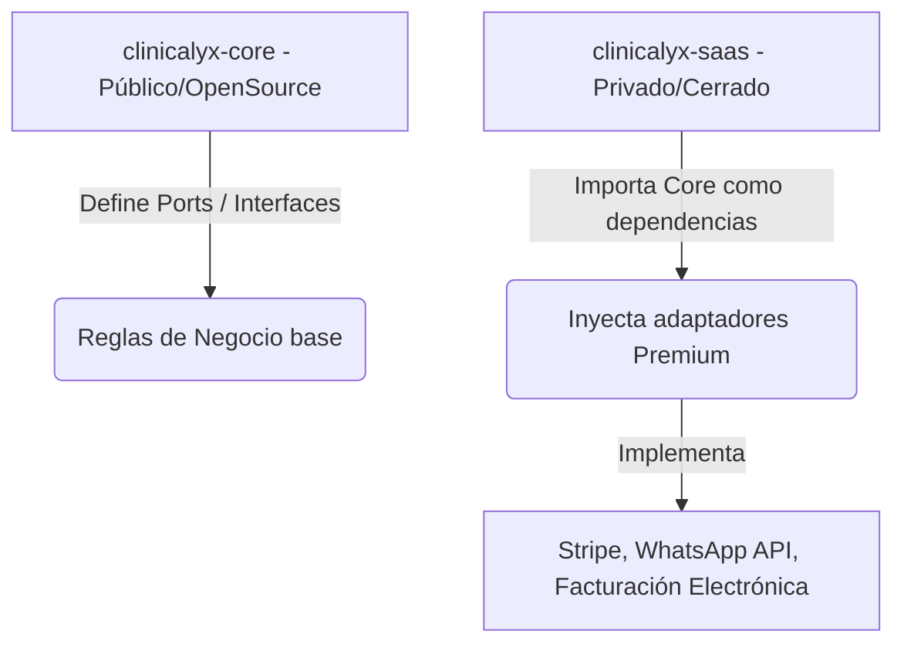

# Plan de Implementación: Clinicalyx Opencore & SaaS Enterprise

Este documento establece la estrategia de arquitectura para el modelo de negocio **Opencore**, el mapa de características (Core vs. Enterprise/SaaS), ejemplos técnicos de inyección de dependencias, el flujo de Git profesional y la metodología TDD para el proyecto **Clinicalyx**.

---

## Estrategia de Repositorio: ¿Uno o Dos Proyectos?

Para comercializar un producto **Opencore** y a la vez ofrecer una versión **SaaS de pago**, la mejor decisión arquitectónica es usar **repositorios separados con inyección de dependencias**. 



### Ejemplo Conceptual en Go (Cómo se inyecta la lógica Premium)

#### 1. En el repositorio público (`clinicalyx-core`)
Definimos los contratos (Puertos) de salida para los servicios que pueden tener versiones comunitarias básicas o versiones premium complejas.

```go
// File: clinicalyx-core/internal/ports/outbound/payment.go
package outbound

// PaymentGateway define el puerto de salida para procesar cobros
type PaymentGateway interface {
    ProcessPayment(amount float64, currency string) (transactionID string, err error)
}
```

El Core consume este puerto en su lógica de negocio (Casos de Uso) sin saber cómo está implementado físicamente:

```go
// File: clinicalyx-core/internal/usecases/payment_usecase.go
package usecases

import "clinicalyx/internal/ports/outbound"

type ProcessPaymentUseCase struct {
    gateway outbound.PaymentGateway // Dependencia abstracta (Port)
}

func NewProcessPaymentUseCase(g outbound.PaymentGateway) *ProcessPaymentUseCase {
    return &ProcessPaymentUseCase{gateway: g}
}

func (uc *ProcessPaymentUseCase) Execute(amount float64) (string, error) {
    // Lógica del Core: validaciones de saldo, registrar en libro diario, etc.
    return uc.gateway.ProcessPayment(amount, "USD")
}
```

#### 2. En el repositorio privado (`clinicalyx-saas` o extensiones premium)
Implementamos el adaptador real utilizando un servicio de pago premium como Stripe:

```go
// File: clinicalyx-premium/adapters/stripe_adapter.go
package adapters

import "github.com/stripe/stripe-go/v72"

type StripeAdapter struct {
    apiKey string
}

func NewStripeAdapter(key string) *StripeAdapter {
    return &StripeAdapter{apiKey: key}
}

// Implementación del método de la interfaz definida en el Core público
func (s *StripeAdapter) ProcessPayment(amount float64, currency string) (string, error) {
    // Lógica privada premium para llamar a las APIs de Stripe
    return "stripe_txn_ok_12345", nil
}
```

#### 3. En el arranque de la aplicación SaaS
En el punto de entrada de la aplicación SaaS, importamos el Core público e inyectamos el adaptador privado:

```go
// File: clinicalyx-saas/cmd/api/main.go
package main

import (
    "github.com/carlos/clinicalyx-core/internal/usecases"
    "github.com/carlos/clinicalyx-saas/adapters"
)

func main() {
    // 1. Inicializar adaptador premium (privado)
    stripeGateway := adapters.NewStripeAdapter("sk_live_xxxx")
    
    // 2. Inyectar adaptador privado en el caso de uso del Core público
    processPaymentUC := usecases.NewProcessPaymentUseCase(stripeGateway)
    
    // 3. Arrancar servidor web y endpoints...
}
```

---

## Mapa de Características (Features)

Para un producto enterprise, las características se dividen entre lo que es de código abierto (Community) y lo que se comercializa bajo suscripción (Enterprise/SaaS):

| Módulo / Feature | Core (Community Edition - Open Source) | Enterprise / SaaS (Premium Edition - Closed Source) |
| :--- | :--- | :--- |
| **Multi-Tenancy** | Aislamiento básico a nivel lógico de datos (PostgreSQL RLS). | Base de datos dedicada por tenant (aislamiento físico para clínicas grandes) + Portal de facturación del plan SaaS. |
| **Pacientes** | CRUD clásico, ficha de datos personales, historial de visitas y perfil. | Búsqueda por IA semántica de pacientes, campos dinámicos customizables según clínica. |
| **Agenda & Citas** | Calendario mensual/semanal, reserva de citas y estados básicos. | Recordatorios automáticos por WhatsApp/SMS, telemedicina integrada y sincronización con Google Calendar. |
| **Historias Clínicas** | Expediente clínico básico con editor de texto enriquecido (HTML/Markdown). | **Especialidades Médicas Inyectables:** Odontograma interactivo, dermatología con galería de evolución comparativa de fotos, ginecología. |
| **Finanzas** | Registro de cobros, abonos y saldos (tipo de dato decimal estricto). | Facturación electrónica legal, control de flujo de caja, pasarelas de pago integradas (Stripe/PayPal), cálculo de comisiones a médicos. |
| **Seguridad & Auditoría** | Autenticación clásica con JWT, encriptación Bcrypt y roles básicos (Admin/Médico). | Autenticación Single Sign-On (SSO), Logs de auditoría inmutables (cumplimiento regulatorio HIPAA/GDPR para datos médicos). |

---

## Proposed Changes

La estructura del nuevo directorio oficial [clinicalyx](file:///home/carlos/Proyectos/clinicalyx) contendrá la versión **Core (Community)** como base del desarrollo local.

### [clinicalyx] (Core Open Source Repository)

#### [NEW] [backend/](file:///home/carlos/Proyectos/clinicalyx/backend)
Backend desarrollado en Go aplicando Arquitectura Hexagonal.
- `backend/cmd/api/`: Orquestador de inicio e inyección de dependencias.
- `backend/internal/domain/`: Modelos del negocio puros (ej. `Patient`, `Appointment`, `Payment`).
- `backend/internal/ports/`: Interfaces de comunicación (inbound y outbound).
- `backend/internal/usecases/`: Casos de uso de la aplicación (lógica de paciente, citas).
- `backend/internal/adapters/`: Controladores HTTP, repositorios de PostgreSQL y encriptación.

#### [NEW] [frontend/](file:///home/carlos/Proyectos/clinicalyx/frontend)
Frontend desarrollado en Next.js (React/TypeScript).

---

## Estrategia TDD (Test-Driven Development)

Toda la lógica del Core se programará bajo el ciclo **Rojo-Verde-Refactor**:
1. **Red:** Escribir pruebas unitarias en Go para los casos de uso (ej. `CreatePatient` con reglas de validación de documento de identidad) que fallen debido a que no hay implementación.
2. **Green:** Desarrollar el código mínimo necesario en el dominio y caso de uso para que las pruebas pasen.
3. **Refactor:** Optimizar el código aplicando SOLID y patrones de diseño (como Factory o Builder) garantizando que los tests se mantengan en verde.

---

## Verification Plan

### Automated Tests
- Ejecutar pruebas unitarias de Go:
  ```bash
  go test -v ./...
  ```
- Ejecución de linters para clean code:
  ```bash
  golangci-lint run
  ```

### Manual Verification
- Pruebas del ciclo de CI/CD simulado a través del flujo de ramas de Git:
  ```bash
  git log --oneline
  ```
