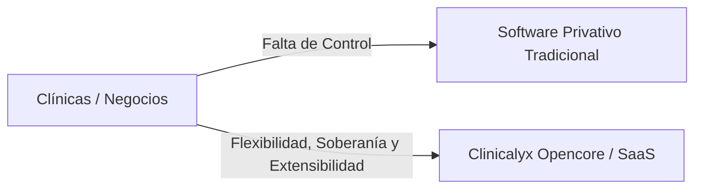
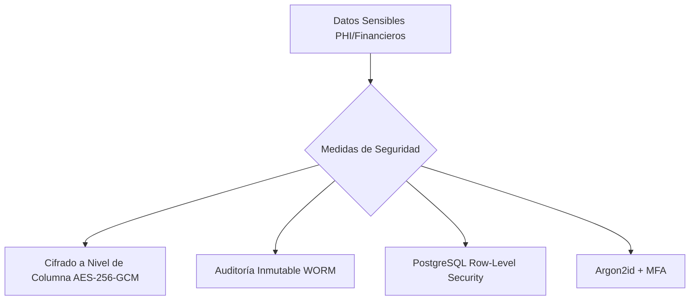
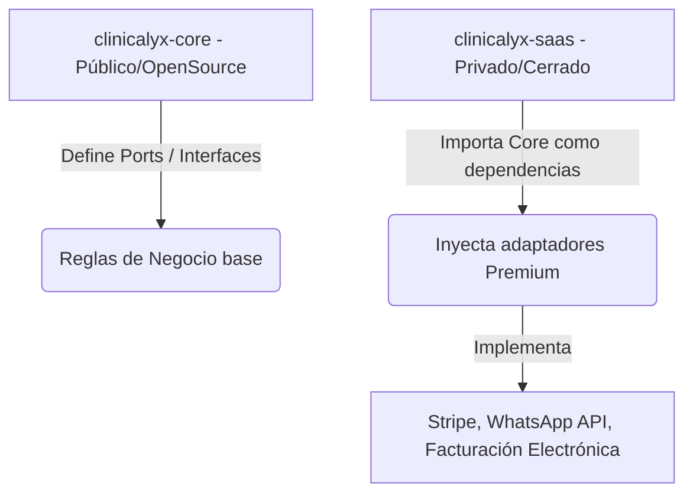

# Plan de Implementación: Clinicalyx Opencore & SaaS Enterprise

Este documento establece la visión estratégica, el modelo de negocio, la arquitectura técnica, la seguridad de datos, el mapa de características, el flujo de Git profesional y la metodología TDD para el proyecto **Clinicalyx**.

---

## 1. Visión Estratégica y Negocio

### ¿Qué es Clinicalyx?
**Clinicalyx** es una plataforma modular de gestión clínica enterprise y de código abierto (**Opencore**). Nace para revolucionar la forma en que los centros de salud gestionan su agenda, pacientes, expedientes clínicos y finanzas, eliminando la rigidez y los altos costos del software privativo tradicional.



### Propuesta de Valor (¿Por qué ayuda a las empresas?)
* **Soberanía y Seguridad de Datos:** A diferencia de las soluciones cerradas en la nube, las grandes clínicas y hospitales exigen control total sobre sus datos de pacientes debido a leyes de privacidad y normativas de salud (HIPAA, GDPR). Clinicalyx les permite hostear su propia infraestructura (on-premise o en su nube privada).
* **Modularidad a Medida:** La mayoría de los softwares del mercado son genéricos o hiper-específicos. Clinicalyx provee un núcleo unificado para la administración, y permite "conectar" módulos específicos por especialidad (ej. un odontograma interactivo para odontólogos, o fichas fotográficas de evolución para medicina estética).
* **Eficiencia Operativa:** El control financiero transaccional estricto (Double-Entry Ledger) evita pérdidas de dinero por abonos mal registrados o desorganización en el flujo de caja diario.

### Modelo de Negocio (Opencore & SaaS)
El proyecto se monetiza bajo un esquema de **Núcleo Abierto (Opencore)**:
1. **Community Edition (Open Source):** Gratuita y autogestionada. Permite a consultorios individuales digitalizar su negocio básico de forma soberana. Crea tracción en la comunidad de desarrolladores y médicos, posicionando a Clinicalyx como el estándar de facto.
2. **SaaS Cloud (Pago por Suscripción):** Clinicalyx administrado en la nube con cobro mensual por usuario o por clínica. Incluye backups automatizados, infraestructura escalable y actualizaciones sin fricción.
3. **Enterprise Edition (Módulos Cerrados):** Clínicas grandes y SaaS consumen módulos premium licenciados (facturación electrónica legal, recordatorios automáticos por WhatsApp API, dashboards de analítica de negocio).

### ¿Cómo estamos innovando?
* **Arquitectura de Ficha Clínica Inyectable:** En lugar de reescribir tablas sql para cada especialidad, usamos PostgreSQL con columnas JSONB dinámicas y esquemas de validación inyectados en tiempo de ejecución, permitiendo que Clinicalyx se adapte a cualquier especialidad médica en minutos sin alterar el núcleo físico de la base de datos.
* **Ingeniería Enterprise desde el Día 1:** Usamos **Arquitectura Hexagonal en Go** y **TDD estricto**. Esto no es el típico proyecto web "juguete" con Laravel acoplado o código espagueti. Es una infraestructura robusta de nivel bancario, diseñada para durar y escalar.

### Proyecciones a Futuro
* **Inteligencia Artificial Clínica (Fase 2):** Copiloto de dictado por voz que transcribe y resume las notas del médico directamente a la historia clínica en formato estructurado (S.O.A.P.).
* **Integración con IoT de Salud:** Recepción de datos de dispositivos médicos portátiles para el seguimiento remoto de pacientes.
* **Ecosistema de Módulos (Marketplace):** Permitir a desarrolladores externos crear y vender adaptadores de especialidades médicas sobre el Core de Clinicalyx.

---

## 2. Arquitectura de Seguridad (HIPAA, GDPR y Blindaje Bancario)

La seguridad de datos de salud y financieros no es una característica que se añade al final; se diseña desde los cimientos (**Security by Design**). En Clinicalyx aplicaremos los siguientes estándares de seguridad enterprise:



### A. Cifrado de Datos en Reposo y en Tránsito
* **En Tránsito:** TLS 1.3 forzado con HSTS (HTTP Strict Transport Security) obligatorio. Ninguna petición viajará sin cifrar.
* **En Reposo a Nivel de Columna (Field-Level Encryption):** Para cumplir con **HIPAA** y **GDPR**, los campos de información médica protegida (PHI) como el texto libre de la historia clínica, diagnósticos, y datos identificatorios del paciente (documento de identidad, email) se guardarán cifrados en PostgreSQL mediante **AES-256-GCM**.
* **Gestión de Claves Externa:** La clave maestra de descifrado (KEK) no se almacenará en la base de datos, sino que se gestionará mediante un servicio externo de KMS (AWS KMS, HashiCorp Vault o Azure Key Vault) con rotación automática de claves.

### B. Bitácora de Auditoría Inmutable (Compliance HIPAA)
* HIPAA exige que cada acceso (lectura o escritura) a datos de salud de un paciente quede registrado de manera auditable.
* Implementaremos una bitácora de logs de auditoría de tipo **WORM (Write Once, Read Many)**. Cada vez que un usuario lea o edite una historia clínica, Go registrará un evento inmutable (Usuario, Acción, Paciente, Timestamp, IP). Estos registros se enviarán a un bucket S3 con bloqueo de objetos (Object Lock) inalterable por un periodo de retención obligatorio (ej. 7 años).

### C. Aislamiento Multi-Tenant con PostgreSQL RLS
* Para blindar el SaaS y evitar filtraciones de datos entre clínicas (ataques tipo IDOR), utilizaremos **Row-Level Security (RLS)** en PostgreSQL.
* Cada consulta a la base de datos se validará a nivel de motor de PostgreSQL inyectando el `tenant_id` de la sesión. Incluso si el desarrollador comete un error en el código de Go y olvida un filtro `WHERE`, el motor de base de datos denegará el acceso si el registro no pertenece a la clínica del usuario autenticado.

### D. Gestión de Identidades Bancaria
* **Hashing de Contraseñas:** Usaremos **Argon2id** (recomendado por OWASP y el estándar de oro actual) en lugar de herramientas obsoletas como MD5 o Bcrypt.
* **Autenticación Multifactor (MFA):** Requisito obligatorio para administradores y personal médico a través de TOTP (Google Authenticator, Authy).
* **Sesiones Seguras:** Los tokens JWT de sesión se almacenarán estrictamente en cookies HTTP-only, Secure y SameSite=Strict para mitigar ataques XSS y CSRF.

### E. Anonimización y Derecho al Olvido (GDPR)
* Cumpliendo con el **GDPR**, el sistema soportará la seudonimización de datos. Si un paciente solicita el "Derecho al Olvido", el sistema borrará sus datos identificatorios (nombres, teléfono, documento) pero conservará de forma anonimizada las historias clínicas para análisis estadístico e histórico de tratamientos de la clínica, sin posibilidad de re-identificación.

---

## 3. Estrategia de Repositorio: ¿Uno o Dos Proyectos?

Para comercializar un producto **Opencore** y a la vez ofrecer una versión **SaaS de pago**, la mejor decisión arquitectónica es usar **repositorios separados con inyección de dependencias**. 



### Ejemplo Conceptual en Go (Cómo se inyecta la lógica Premium)

#### A. En el repositorio público (`clinicalyx-core`)
Definimos los contratos (Puertos) de salida para los servicios que pueden tener versiones comunitarias básicas o versiones premium complejas.

```go
// File: clinicalyx-core/internal/ports/outbound/payment.go
package outbound

// PaymentGateway define el puerto de salida para procesar cobros
type PaymentGateway interface {
    ProcessPayment(amount float64, currency string) (transactionID string, err error)
}
```

El Core consume este puerto en su lógica de negocio (Casos de Uso) sin saber cómo está implementado físicamente:

```go
// File: clinicalyx-core/internal/usecases/payment_usecase.go
package usecases

import "clinicalyx/internal/ports/outbound"

type ProcessPaymentUseCase struct {
    gateway outbound.PaymentGateway // Dependencia abstracta (Port)
}

func NewProcessPaymentUseCase(g outbound.PaymentGateway) *ProcessPaymentUseCase {
    return &ProcessPaymentUseCase{gateway: g}
}

func (uc *ProcessPaymentUseCase) Execute(amount float64) (string, error) {
    // Lógica del Core: validaciones de saldo, registrar en libro diario, etc.
    return uc.gateway.ProcessPayment(amount, "USD")
}
```

#### B. En el repositorio privado (`clinicalyx-saas` o extensiones premium)
Implementamos el adaptador real utilizando un servicio de pago premium como Stripe:

```go
// File: clinicalyx-premium/adapters/stripe_adapter.go
package adapters

import "github.com/stripe/stripe-go/v72"

type StripeAdapter struct {
    apiKey string
}

func NewStripeAdapter(key string) *StripeAdapter {
    return &StripeAdapter{apiKey: key}
}

// Implementación del método de la interfaz definida en el Core público
func (s *StripeAdapter) ProcessPayment(amount float64, currency string) (string, error) {
    // Lógica privada premium para llamar a las APIs de Stripe
    return "stripe_txn_ok_12345", nil
}
```

#### C. En el arranque de la aplicación SaaS
En el punto de entrada de la aplicación SaaS, importamos el Core público e inyectamos el adaptador privado:

```go
// File: clinicalyx-saas/cmd/api/main.go
package main

import (
    "github.com/carlos/clinicalyx-core/internal/usecases"
    "github.com/carlos/clinicalyx-saas/adapters"
)

func main() {
    // 1. Inicializar adaptador premium (privado)
    stripeGateway := adapters.NewStripeAdapter("sk_live_xxxx")
    
    // 2. Inyectar adaptador privado en el caso de uso del Core público
    processPaymentUC := usecases.NewProcessPaymentUseCase(stripeGateway)
    
    // 3. Arrancar servidor web y endpoints...
}
```

---

## 4. Mapa de Características (Features)

Para un producto enterprise, las características se dividen entre lo que es de código abierto (Community) y lo que se comercializa bajo suscripción (Enterprise/SaaS):

| Módulo / Feature | Core (Community Edition - Open Source) | Enterprise / SaaS (Premium Edition - Closed Source) |
| :--- | :--- | :--- |
| **Multi-Tenancy** | Aislamiento básico a nivel lógico de datos (PostgreSQL RLS). | Base de datos dedicada por tenant (aislamiento físico para clínicas grandes) + Portal de facturación del plan SaaS. |
| **Pacientes** | CRUD clásico, ficha de datos personales, historial de visitas y perfil. | Búsqueda por IA semántica de pacientes, campos dinámicos customizables según clínica. |
| **Agenda & Citas** | Calendario mensual/semanal, reserva de citas y estados básicos. | Recordatorios automáticos por WhatsApp/SMS, telemedicina integrada y sincronización con Google Calendar. |
| **Historias Clínicas** | Expediente clínico básico con editor de texto enriquecido (HTML/Markdown). | **Especialidades Médicas Inyectables:** Odontograma interactivo, dermatología con galería de evolución comparativa de fotos, ginecología. |
| **Finanzas** | Registro de cobros, abonos y saldos (tipo de dato decimal estricto). | Facturación electrónica legal, control de flujo de caja, pasarelas de pago integradas (Stripe/PayPal), cálculo de comisiones a médicos. |
| **Seguridad & Auditoría** | Autenticación clásica con JWT, encriptación Bcrypt y roles básicos (Admin/Médico). | Autenticación Single Sign-On (SSO), Logs de auditoría inmutables (cumplimiento regulatorio HIPAA/GDPR para datos médicos). |

---

## 5. Proposed Changes

La estructura del nuevo directorio oficial [clinicalyx](file:///home/carlos/Proyectos/clinicalyx) contendrá la versión **Core (Community)** como base del desarrollo local.

### [clinicalyx] (Core Open Source Repository)

#### [NEW] [backend/](file:///home/carlos/Proyectos/clinicalyx/backend)
Backend desarrollado en Go aplicando Arquitectura Hexagonal.
- `backend/cmd/api/`: Orquestador de inicio e inyección de dependencias.
- `backend/internal/domain/`: Modelos del negocio puros (ej. `Patient`, `Appointment`, `Payment`).
- `backend/internal/ports/`: Interfaces de comunicación (inbound y outbound).
- `backend/internal/usecases/`: Casos de uso de la aplicación (lógica de paciente, citas).
- `backend/internal/adapters/`: Controladores HTTP, repositorios de PostgreSQL y encriptación.

#### [NEW] [frontend/](file:///home/carlos/Proyectos/clinicalyx/frontend)
Frontend desarrollado en Next.js (React/TypeScript).

---

## 6. Estrategia TDD (Test-Driven Development)

Toda la lógica del Core se programará bajo el ciclo **Rojo-Verde-Refactor**:
1. **Red:** Escribir pruebas unitarias en Go para los casos de uso (ej. `CreatePatient` con reglas de validación de documento de identidad) que fallen debido a que no hay implementación.
2. **Green:** Desarrollar el código mínimo necesario en el dominio y caso de uso para que las pruebas pasen.
3. **Refactor:** Optimizar el código aplicando SOLID y patrones de diseño (como Factory o Builder) garantizando que los tests se mantengan en verde.

---

## 7. Verification Plan

### Automated Tests
- Ejecutar pruebas unitarias de Go:
  ```bash
  go test -v ./...
  ```
- Ejecución de linters para clean code:
  ```bash
  golangci-lint run
  ```

### Manual Verification
- Pruebas del ciclo de CI/CD simulado a través del flujo de ramas de Git:
  ```bash
  git log --oneline
  ```
